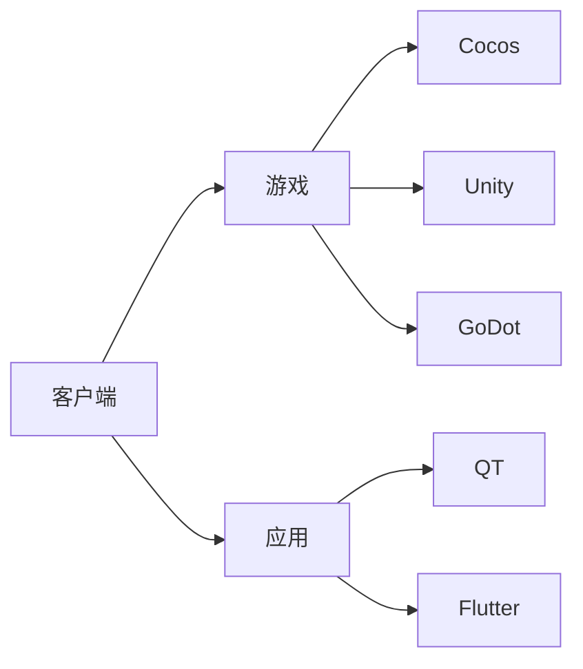

# wfxx
<picture>
  <source
    media="(prefers-color-scheme: dark)"
    srcset="https://raw.githubusercontent.com/wfxx/wfxx/master/assets/github-contribution-grid-snake.svg"
  />
  <source
    media="(prefers-color-scheme: light)"
    srcset="https://raw.githubusercontent.com/wfxx/wfxx/master/assets/github-contribution-grid-snake.svg"
  />
  
</picture>
# 技术栈

<!---
wfxx/wfxx is a ✨ special ✨ repository because its `README.md` (this file) appears on your GitHub profile.
You can click the Preview link to take a look at your changes.
--->
