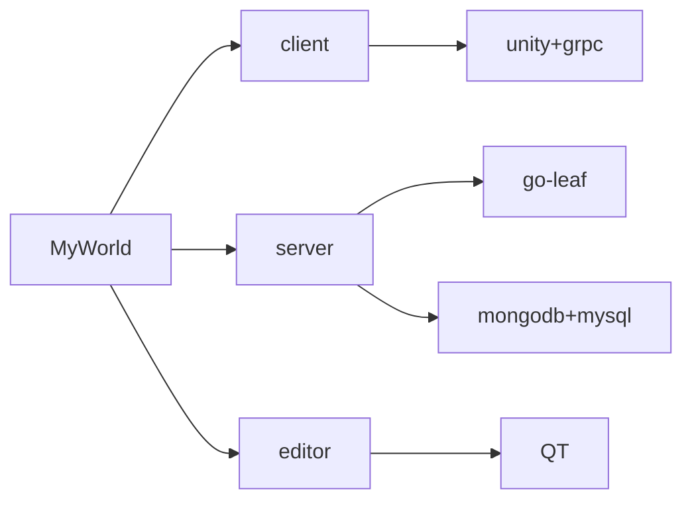
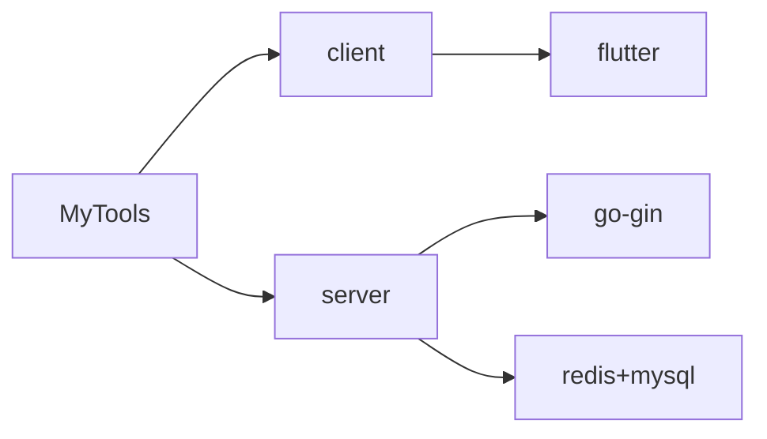
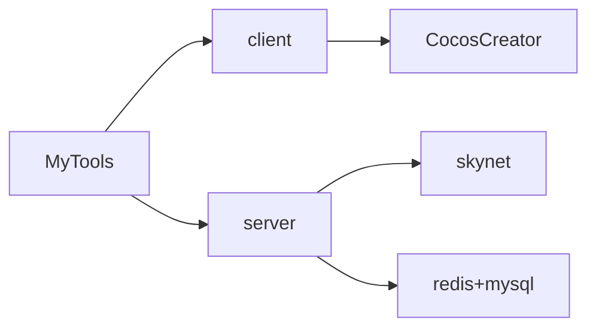

> 最喜欢的编程语言是C++,python和go
# MyWorld

# MyTools

# MyGames

<!---
wfxx/wfxx is a ✨ special ✨ repository because its `README.md` (this file) appears on your GitHub profile.
You can click the Preview link to take a look at your changes.
--->
